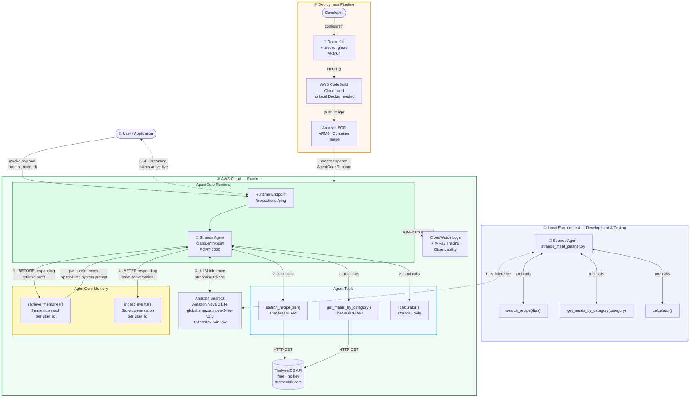
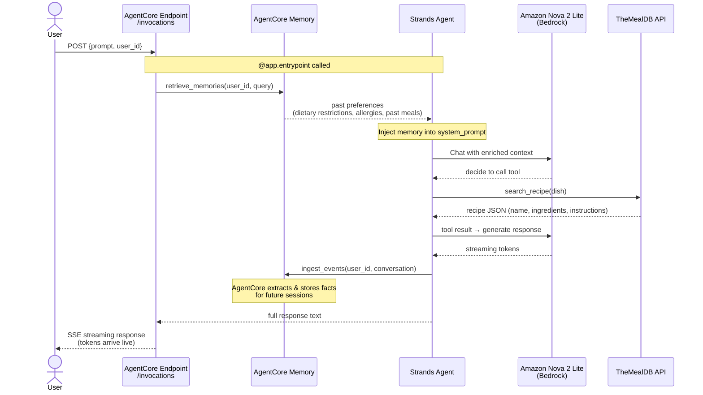
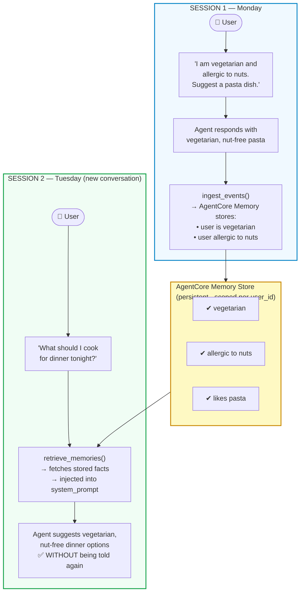
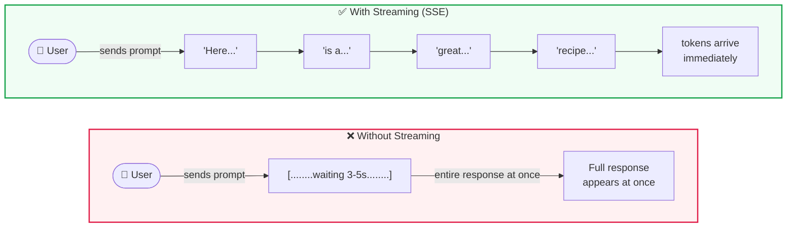

# Smart Meal Planner Agent — Architecture

> **Notebook:** `meal_planner_with_memory_and_streaming.ipynb`
> **Model:** Amazon Nova 2 Lite (`global.amazon.nova-2-lite-v1:0`)
> **Framework:** Strands Agents + Amazon Bedrock AgentCore Runtime

---

## What Changed from the Original

| Original (Weather Agent) | New (Meal Planner Agent) |
|:---|:---|
| `get_weather()` tool | `search_recipe()` — TheMealDB API |
| `calculator()` tool | `get_meals_by_category()` — TheMealDB API |
| — | `calculator()` — retained for recipe scaling |
| Claude Haiku 4.5 | **Amazon Nova 2 Lite** |
| No memory | **AgentCore Memory** (cross-session persistence) |
| Full response only | **Streaming** (SSE token-by-token) |
| Single architecture phase | **3 phases**: Local → Configure → Deploy |

---

## Diagram 1 — Complete End-to-End Architecture

---

## Diagram 2 — Deployment Pipeline (Configure → Launch → Invoke)

Mirrors the original `configure.png`, `launch.png`, and `invoke.png` — updated for the Meal Planner.

```mermaid
flowchart LR
    subgraph CODE["Agent Code\nstrands_meal_planner.py"]
        direction TB
        M["Nova 2 Lite\nBedrockModel"]
        F["Strands Framework\n@tool decorators"]
        D["@app.entrypoint\nBedrockAgentCoreApp"]
        MEM_CODE["Memory helpers\nretrieve / save"]
    end

    DEV(["</> Application\nDeveloper"])
    DOCKER["🐳 Dockerfile\nARM64\n+ .dockerignore"]
    CB["AWS CodeBuild\nCloud build"]
    ECR["Amazon ECR\nContainer Registry"]

    subgraph RT["AgentCore Runtime"]
        direction TB
        RA["Runtime Agent\nPORT 8080"]
        RE["/invocations\n/ping"]
    end

    APP(["👤 User\nApplication"])

    DEV -->|"runtime.configure()\nauto_create_ecr=True\nauto_create_execution_role=True\nenv: MEMORY_ID"| DOCKER
    CODE --> DOCKER
    DOCKER -->|"runtime.launch()\nCodeBuild mode"| CB
    CB -->|"ARM64 image push"| ECR
    ECR -->|"create_agent_runtime()"| RT
    APP -->|"invoke_agent_runtime()\n{prompt, user_id}"| RE
    RE --> RA
    RA -.->|"SSE streaming response"| APP

    style CODE fill:#f5f3ff,stroke:#7c3aed,stroke-width:2px
    style RT fill:#dcfce7,stroke:#15803d,stroke-width:2px
```

---

## Diagram 3 — Request Lifecycle (Sequence)

Shows exactly what happens inside the Runtime on every single request — the memory + tool + LLM flow.

---

## Diagram 4 — AgentCore Memory Flow Detail

Shows the before/after of memory across two separate sessions — the core teaching point.

---

## Diagram 5 — Streaming vs Non-Streaming

---

## Component Summary

| Component | Service / Tool | Role |
|:---|:---|:---|
| **Agent Framework** | Strands Agents | Orchestrates tools + LLM loop |
| **LLM** | Amazon Nova 2 Lite (Bedrock) | Reasoning, response generation |
| **Tool 1** | `search_recipe()` → TheMealDB | Fetch recipe by dish name |
| **Tool 2** | `get_meals_by_category()` → TheMealDB | Browse meals by category |
| **Tool 3** | `calculator()` → strands_tools | Scale recipe quantities |
| **Memory** | AgentCore Memory | Persist user prefs cross-session |
| **Streaming** | SSE via AgentCore Runtime | Token-by-token response |
| **Container Build** | AWS CodeBuild | ARM64 image build (no local Docker) |
| **Image Registry** | Amazon ECR | Store ARM64 container image |
| **Hosting** | AgentCore Runtime | Serverless agent hosting, `/invocations` + `/ping` |
| **Observability** | CloudWatch + X-Ray | Logs, traces, GenAI dashboard |

---

## Key Code Touchpoints

| What | File | Pattern |
|:---|:---|:---|
| Local agent entry | `meal_planner.py` | `def meal_planner(payload)` |
| AgentCore entry | `strands_meal_planner.py` | `@app.entrypoint` |
| Memory retrieve | `strands_meal_planner.py` | `retrieve_preferences(user_id, query)` |
| Memory save | `strands_meal_planner.py` | `save_interaction(user_id, msg, reply)` |
| Model selection | both files | `BedrockModel(model_id="global.amazon.nova-2-lite-v1:0")` |
| Deploy configure | notebook cell | `runtime.configure(entrypoint=..., environment_variables={"MEMORY_ID": ...})` |
| Deploy launch | notebook cell | `runtime.launch()` — CodeBuild mode |
| Invoke | notebook cell | `agentcore_runtime.invoke({prompt, user_id})` |
| Streaming invoke | notebook cell | `boto3` EventStream parsing |
